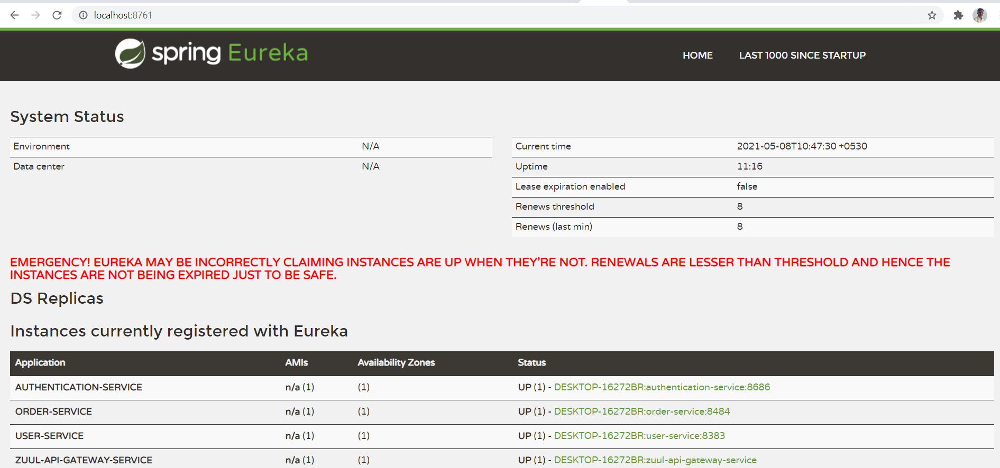
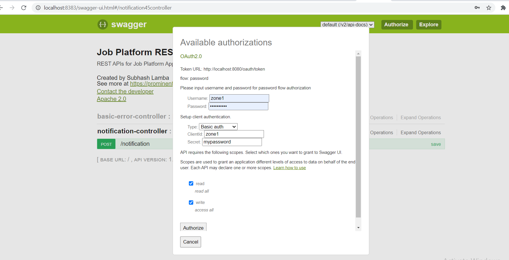
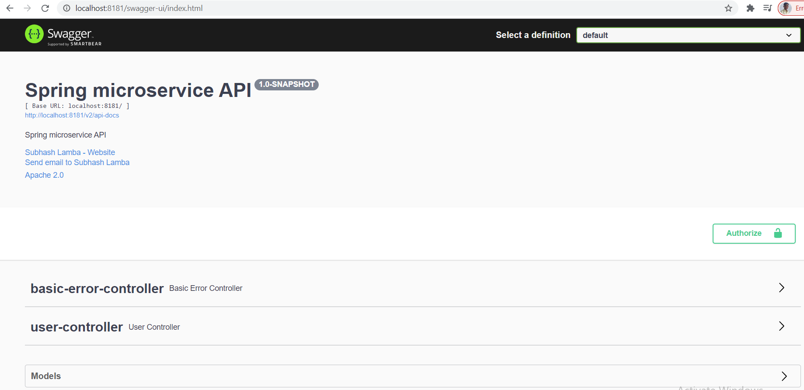
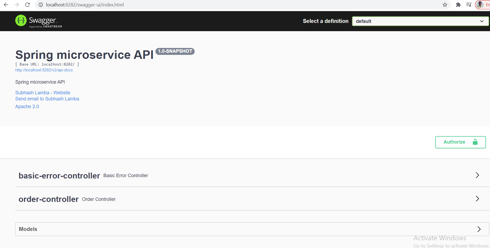

# Spring boot microservice example

Spring boot microservice example with Eureka Server + Eureka Client + Spring Cloud API Gateway + OAuth2.0 + Circuit Breaker + Resilience4J + FeignClient + RestTemplate

- **Eureka Server** : Eureka service registry
- **Spring Cloud API Gateway**: API Gateway which is responsible to route the request to specific microservice
- **Spring OAuth2.0**: Authentication service and responsible to secure the end points.
   - Eureka Client
   - Generate OAuth token
   - Validate the OAuth token
- **User Service**: User microservice with a basic feature
   - Eureka Client
   - OAuth2.0 Client
   - Supports RestTemplate Client
   - Supports Resilience4J circuit breaker
   - Use of Resilience4J circuit breaker with RestTemplate
   - Swagger Document - [http://localhost:8181/swagger-ui/index.html](http://localhost:8181/swagger-ui/index.html)
- **Order Service**: Order microservice with a basic feature
   - Eureka Client
   - OAuth2.0 Client
   - Supports FeignClient Client
   - Supports Resilience4J circuit breaker
   - Use of Resilience4J circuit breaker with FeignClient
   - Swagger Document - [http://localhost:8282/swagger-ui/index.html](http://localhost:8282/swagger-ui/index.html)
- **Notification Service**: Notification microservice with basic feature
   - Eureka Client
   - OAuth2.0 Client
   - Swagger Document - [http://localhost:8383/swagger-ui/index.html](http://localhost:8383/swagger-ui/index.html)

## Checkout repository


## Step 1: Start all services

### 1.1 For windows:

```sh
mvn clean install -f .\spring-boot-cloud-eureka-server\pom.xml
mvn clean install -f .\spring-boot-cloud-api-gateway-routing\pom.xml
mvn clean install -f .\spring-boot-cloud-eureka-user-service\pom.xml
mvn clean install -f .\spring-boot-cloud-eureka-order-service\pom.xml
mvn clean install -f .\spring-boot-cloud-eureka-notification-service\pom.xml
mvn clean install -f .\spring-boot-cloud-authentication-service\pom.xml

START "Server" java -jar spring-boot-cloud-eureka-server/target/eureka-server.jar 
START "API Gateway" java -jar spring-boot-cloud-api-gateway-routing/target/zuul-api-gateway.jar --server.port=8080  
START "User Service" java -jar spring-boot-cloud-eureka-user-service/target/user-service.jar --server.port=8181
START "Order Service" java -jar spring-boot-cloud-eureka-order-service/target/order-service.jar --server.port=8282
START "Notification Service" java -jar spring-boot-cloud-eureka-notification-service/target/notification-service.jar --server.port=8383
START "Authentication Service" java -jar spring-boot-cloud-authentication-service/target/authentication-service.jar --server.port=8484

```

## Step 2: Check Eureka Server

Eureka server is running 8761 port, Now let's open it. Where we can check following instances are running:

* 1 instance of API Gateway service
* 1 instance of User service
* 1 instance of Order service
* 1 instance of Authentication service
* 1 instance of Notification service


### Eureka server : [http://localhost:8761/](http://localhost:8761/)




## Step 3: Generate OAuth2.0 token

### 3.1 Using swagger
    In the swagger UI, There is a "Autorize" button on the top, click on it it will open the following popup:



Use the following information

```
Username: zone1
Password: mypassword
ClientId: javadeveloperzone
Secret: secret
```
Output

```sh
{
    "access_token": "imdUX2_t_WQLSTUlaLBTjVyHUTg",
    "token_type": "bearer",
    "refresh_token": "zLufOQtLQO1u-8JP7KN64Dsc3wc",
    "expires_in": 522,
    "scope": "read write"
}
```

## Step 4: Create user using user microservice


### 4.1 Using Swagger UI



## Step 5: Create order using order microservice


###5.1 Using Swagger UI




## Step 6: Get user and order using user microservice

{
"user": {
"id": 1,
"firstName": "Sherman",
"lastName": "Li"
},
"orders": [
{
"id": 5,
"orderDate": "2024-01-01T00:00:00.000+00:00",
"userId": 1
}
]
}
```

### 6.1 Using Swagger UI 


